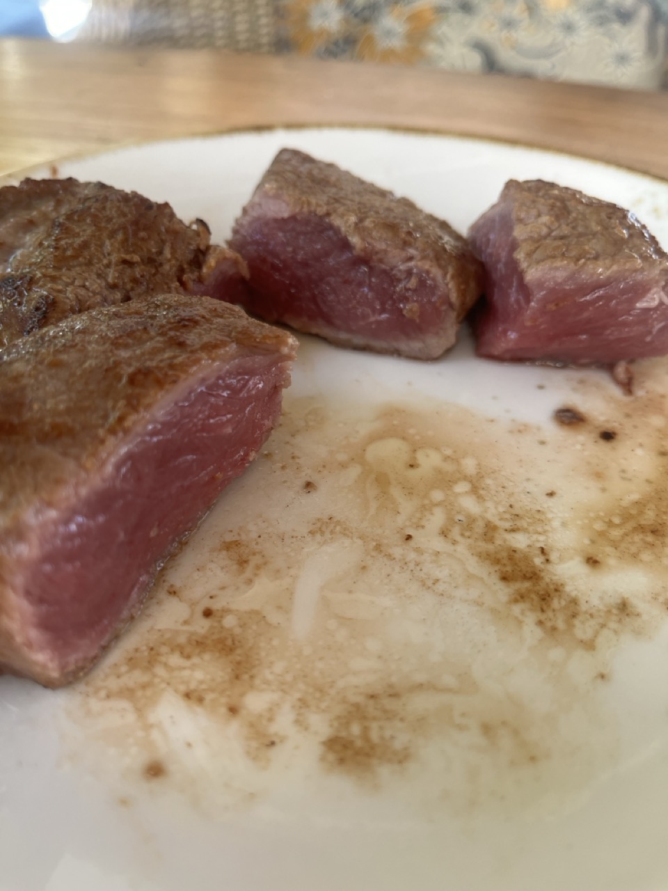
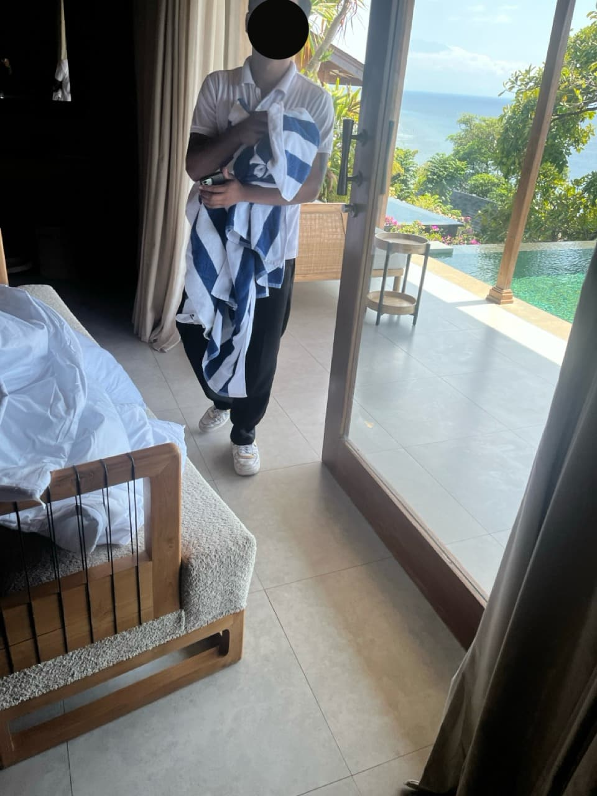

# RESORT INCIDENT REPORT - SEMAYA BEACH RESORT, NUSA PENIDA, BALI

## SUMMARY OF INCIDENTS AND VIOLATIONS

**Resort Name:** Semaya Beach Resort  
**Location:** Jl. Raya Batukandik, Nusa Penida, Klungkung Regency, Bali 80771, Indonesia  

---

## CRITICAL HEALTH & SAFETY VIOLATIONS DOCUMENTED

### 1. FOOD SAFETY VIOLATION - RAW CHICKEN SERVED AS BEEF
**Severity: CRITICAL**

- **Incident:** Ordered rare beef at resort restaurant, received and consumed raw chicken/pork
- **Health Impact:** 
  - Guest 1: Severe stomach cramps same evening
  - Guest 2: Serious gastrointestinal illness 48 hours later
- **Medical Treatment Required:** Doctor visit for parasitic testing (stool test)
- **Resort Response:** 
  - Restaurant Manager **Andika Putra** repeatedly lied, insisting it was beef
  - Operations Manager **Sindra Sindrawan** initially admitted it wasn't beef, then backtracked
  - Resort refused to pay for medical expenses despite serving contaminated food

**Evidence:**

- Photographs of raw meat served
  - Raw meat served as "rare beef"
    
    
  
  - Close-up of meat texture
    
    

- Professional chef confirmation that meat was not beef
  - Message to chef friend (Thai)
    
    
  
  - Chef's response translated
    
    

- Social media forum verification (banned for posting non-steak)
  - Reddit responses part 1
    
    
  
  - Reddit responses part 2
    
    
  
  - Banned from steak forum
    
    

- ChatGPT AI analysis confirming meat was not beef
  - ChatGPT identifies real beef
    
    
  
  - ChatGPT says original meal cannot be beef
    
    

- Medical receipts for parasite testing
  - Doctor's receipt
    
    

- Anti-parasite medication documentation
  - Anti-parasite medication
    
    

- Management evidence
  - Restaurant Manager Andika Putra
    
    
  
  - Operations Manager Sindra Sindrawan
    
    
  
  - Beef packaging shown as "proof"
    
    
  
  - Actually cooked beef for comparison
    
    

**Authorities Notified:**

- Local Health Ministry - INFORMED
- US Embassy in Jakarta - NOTIFIED

---

### 2. WATER SAFETY VIOLATIONS

**A. Contaminated Water Supply**

- Yellow/brown water from bathroom faucets
- Video evidence of contaminated water
- Unsuitable for brushing teeth or basic hygiene

**B. Drinking Water Issues**

- No complimentary sealed water provided (5-star standard violation)
- Charged 160,000 IDR (~$10 USD) for 2 bottles of water
- Provided unsealed, refillable containers of unknown safety
  
  
  
- Hygiene protocols for water handling unknown

---

### 3. HYGIENE & SANITATION FAILURES

**Housekeeping Standards:**

- Staff cleaned rooms wearing outdoor shoes
  
  
  
- Tracking street contamination into guest rooms
- Basic hygiene protocols ignored

**Bathroom Conditions:**

- Open-air design with zero privacy
  
  
  
- Smoking/non-smoking rooms adjacent (smoke contamination)
  
  
  
- Inadequate hot water (15 minutes maximum)
- Sound privacy issues during illness episodes

---

### 4. EQUIPMENT SAFETY HAZARDS

**Bicycle Rentals:**

- Flat tires on rental bikes
  
  
  
- Broken/non-functional brakes (video evidence)
- No safety equipment provided (helmets, lights)
- Dangerous for use on unlit local roads
- Broken kickstands causing bikes to fall

**Fitness Equipment:**

- Unstable single-machine gym equipment
  
  
- Extremely low weight capacity
- Plastic "dumbbells" unsuitable for exercise
- Equipment poses injury risk

---

### 5. MANAGEMENT FAILURES

**Key Personnel Involved:**

- **Andika Putra** - Restaurant Manager
  - Lied repeatedly about raw chicken being beef
  - Claimed it was "just a bad batch"
  - Failed to take food safety seriously

- **Sindra Sindrawan** - Operations Manager  
  - Initially honest about meat not being beef
  - Later backtracked under pressure
  - Participated in gaslighting attempt

**Systemic Issues:**

- No senior management available on-site during crisis
- Attempted to gaslight guests about food poisoning
- Refused medical expense reimbursement
- Zero accountability for health violations
- Complete failure of basic hospitality standards

---

## FINANCIAL DAMAGES

- Medical expenses: $411 usd
- Doctor consultation and testing fees
- Anti-parasite medication costs
- Lost vacation days due to illness
- Substandard accommodations despite premium pricing

---

## FINAL ASSESSMENT

**Overall Rating: 1/5 Stars**

This establishment operates with complete disregard for:

- Guest health and safety
- Basic food safety protocols
- Water quality standards
- Equipment maintenance and safety
- Professional hospitality standards
- Guest welfare and accountability

The resort represents a significant health hazard to guests and should not be operating at its current standards. The management's response to serious health violations was dishonest, unprofessional, and potentially criminal.

---

## DOCUMENTATION & EVIDENCE

Full photographic and video evidence, including:

- Raw meat photographs
- Water contamination videos
- Medical receipts
- Management confrontation documentation
- Equipment failure videos
- Social media verification
- AI analysis confirmation

All evidence has been preserved and is available for review by relevant authorities, legal counsel, and dispute resolution services.

---

## PUBLIC WARNING ISSUED

A comprehensive public warning has been published documenting all incidents and violations. This serves as a consumer protection notice to prevent other travelers from experiencing similar health risks and safety violations.

**Full documentation available at:** https://semayabeachresortreview.com

---

*This report is a factual account of documented incidents and violations experienced during the stay at Semaya Beach Resort. All statements are supported by photographic, video, and documentary evidence.*

*Report prepared for dispute resolution and legal documentation purposes.*